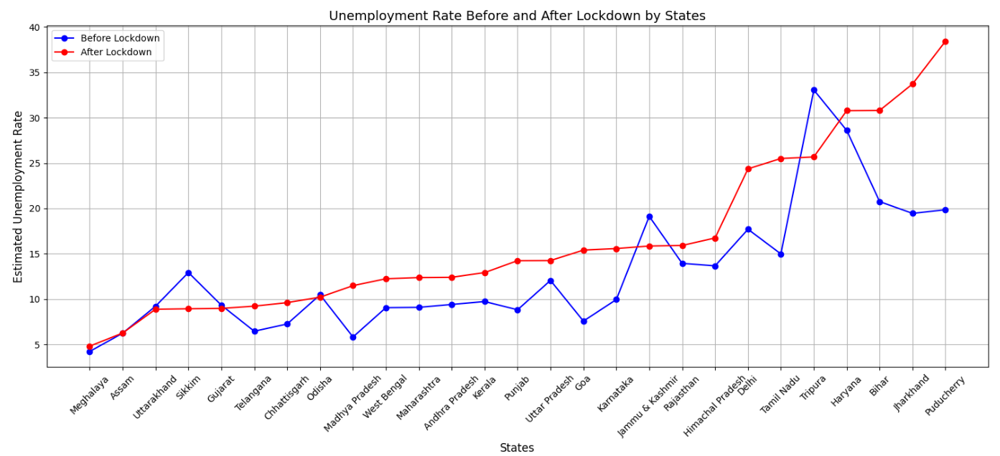

# 📊 Unemployment Analysis due to COVID

## 🎯 Goal
The goal of this project is to analyze the impact of the COVID-19 pandemic on unemployment rates across different states and regions in India. The purpose of this analysis is to identify the most affected states, observe the trends before and after lockdown periods, and gain insights into the economic repercussions of the pandemic.

## 🧵 Dataset
The dataset used in this project is titled "Unemployment in India," and it is sourced from Kaggle. The dataset provides comprehensive data on unemployment rates across India, segmented by states and regions during the COVID-19 pandemic.

🔗 [Dataset link](https://www.kaggle.com/datasets/gokulrajkmv/unemployment-in-india)

## 🧾 Description
This project focuses on the analysis of unemployment rates in India during the COVID-19 pandemic. By comparing unemployment rates before and after the lockdown phases, this analysis seeks to uncover key insights into how different regions were impacted. Visualizations are used to understand patterns and trends in unemployment rates at both the state and region levels.

## 🧮 What I had done!
1. **Data Import and Cleaning**: Imported the dataset and performed necessary data cleaning such as handling missing values and formatting the dataset for analysis.
2. **Exploratory Data Analysis (EDA)**: Conducted EDA to gain insights into the unemployment rate trends across different states and regions.
3. **State-wise Analysis**: Grouped the data by states and calculated the mean unemployment rate for each state.
4. **Region-wise Analysis**: Similarly grouped the data by regions to observe trends across different parts of India.
5. **Lockdown Impact Analysis**: Divided the dataset into two periods: before lockdown and after lockdown. Compared the unemployment rates between these periods for various states.
6. **Visualization**: Created insightful visualizations, such as bar graphs ,Pie charts and line plots, to illustrate unemployment trends and lockdown impacts.

## 🚀 Models Implemented
This project does not involve machine learning models as it focuses solely on data analysis and visualization.

## 📚 Libraries Needed
The following libraries were used in the project:
- `pandas` – For data manipulation and analysis.
- `numpy` – For numerical computations.
- `matplotlib` – For static visualizations.
- `seaborn` – For enhanced visualizations and styling.
- `plotly` – For interactive plots and charts.

## 📊 Exploratory Data Analysis Results
### Unemployment Rate Before and After Lockdown by States

### Estimated Unemployment Rate by Region

*These visualizations highlight the unemployment trends across different states and regions, along with the effect of the COVID-19 lockdown on unemployment rates.*

## 📈 Performance of the Models based on the Accuracy Scores
Since this project is focused on data analysis and does not involve machine learning, model accuracy scores are not applicable.

## 📢 Conclusion
From this analysis, it is clear that the COVID-19 pandemic and the subsequent lockdown significantly impacted the unemployment rates across different states in India. States like **Puducherry, Jharkhand, Bihar, Haryana, and Tamil Nadu** were among the most severely affected. The lockdown period showed a noticeable increase in unemployment rates across the nation, with varying impacts in different regions. 

This project provides valuable insights into the socio-economic impact of the pandemic and can be used as a reference for further studies.

---

### ✒️ Your Signature
**Shreya Tripathy**  
[LinkedIn](https://www.linkedin.com/in/shreyatripathy7/) | [GitHub](https://github.com/Shreya7tripathy)

