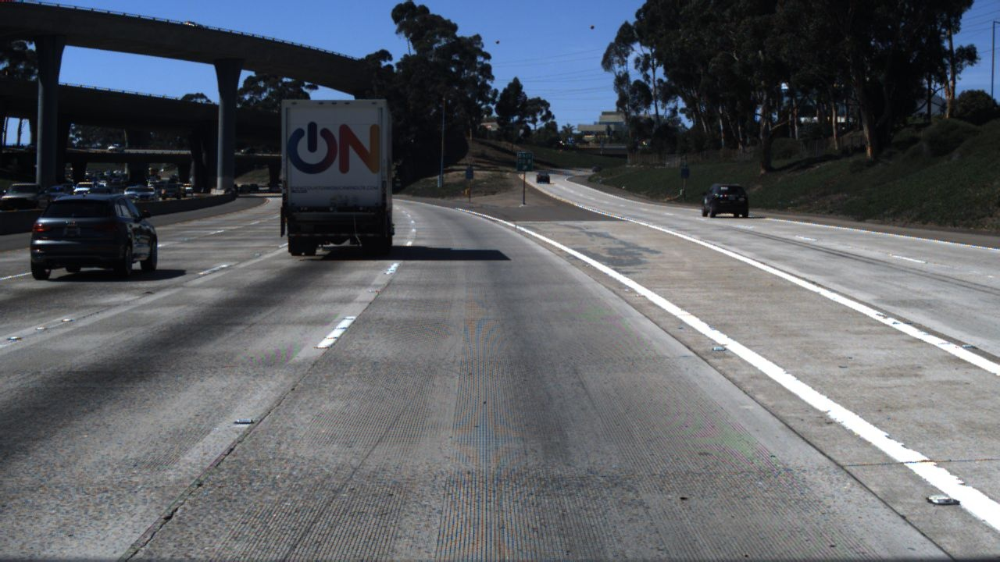
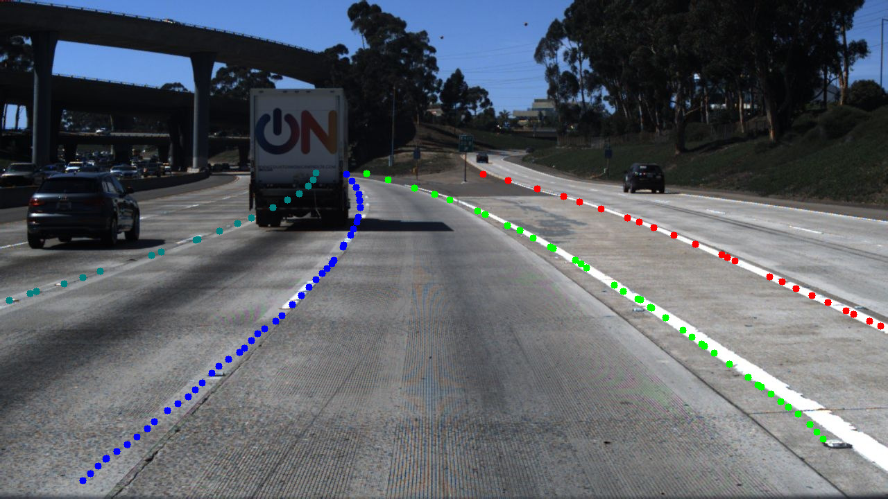

# Lane-Line-Detection

## Description

Lane-Line-Detection is a project designed to detect lane lines in video streams or images using computer vision techniques. Leveraging OpenCV and Python, this project identifies and highlights lane markings, playing a crucial role in the development of autonomous driving systems.

## Table of Contents

- [Usage](#usage)
- [Results](#results)
- [License](#license)
  
## Prerequisites

Make sure the following dependencies are installed on your system:
- Python 3.x
- pip

### Setup Instructions

1. Clone the repository:
   ```bash
   git clone https://github.com/your_username/Lane-Line-Detection.git
   cd Lane-Line-Detection
   ```

2. Install the required packages using:
   ```bash
   pip install -r requirements.txt
   ```

## Usage

### Running Lane Line Detection

1. To detect lane lines in a video file:
   ```bash
   python lane_detection.py --video_path path/to/your/video.mp4
   ```

2. To detect lane lines in an image:
   ```bash
   python lane_detection.py --image_path path/to/your/image.jpg
   ```

## Results

Here are some results from the lane line detection process:

### Original Image:


### Processed Image:


### Lane Line Detection in Action (GIF):


## License

This project is licensed under the MIT License. For more information, refer to the [LICENSE](LICENSE) file.
